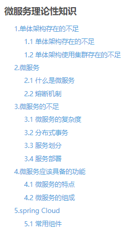
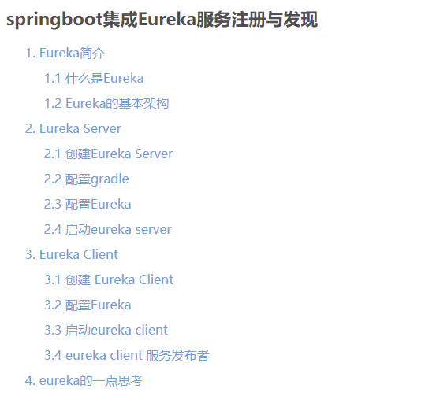
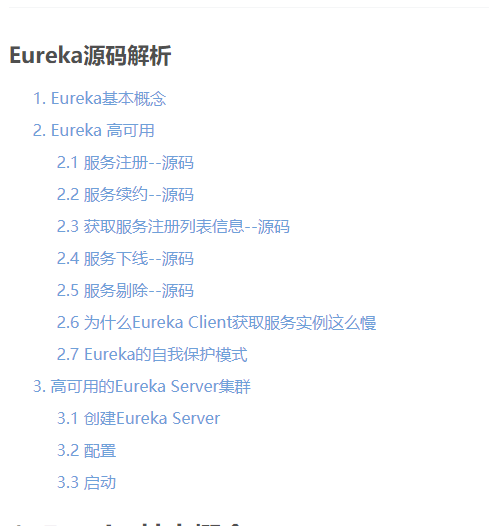
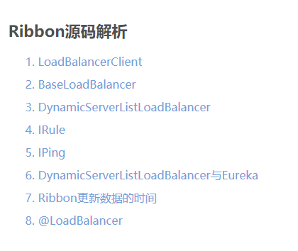
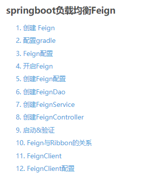
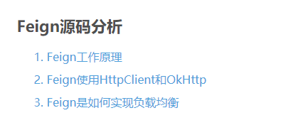

# studySpringCloud
study spring cloud

## 1.[微服务理论性知识](https://blog.csdn.net/a18792721831/article/details/104275405)
从书本上摘抄一些知识点。  

## 2.[spring boot创建+配置](https://blog.csdn.net/a18792721831/article/details/104290947)
spring boot 如何创建，如何配置，如何读取配置，如何自定义配置，如何读取yml自定义配置。  

## 3.[spring boot 运行时监控actuator](https://blog.csdn.net/a18792721831/article/details/104363642)
spring boot 运行时监控actuator的创建，配置，已经简单使用.  

## 4.[spring boot 整合JPA](https://blog.csdn.net/a18792721831/article/details/104380311)
spring boot 整合JPA，创建，集成。jpa的使用，Dao,Service,Controller编写，以及测试类的编写.  

## 5.[spring boot整合Redis](https://blog.csdn.net/a18792721831/article/details/104399126)
spring boot整合Redis，创建、docker启动redis，创建dao以及测试dao等等。  

## 6.[spring boot 整合 swagger](https://blog.csdn.net/a18792721831/article/details/104399638)
spring boot 整合 swagger Swagger，中文“拽”的意思，它是一个功能强大的在线 API文档的框架，目前它的版本
为2.x，所以称为 Swagger2。Swagger2提供了在线文档的查阅和测试功能。利用 Swagger2很容易构建RESTful 风格的API，在Spring Boot 中集成 Swagger2。  

## 7.[springboot集成Eureka服务注册与发现](https://blog.csdn.net/a18792721831/article/details/104444686)
springboot集成Eureka服务注册与发现,以及eureka server,eureka client的入门。  

## 8.[Eureka源码解析](https://blog.csdn.net/a18792721831/article/details/104458740)
Eureka源码解析，基本操作，主要方法的源码分析；自我保护机制，Eureka Server的集群化。  

## 9.[spring boot 负载均衡Ribbon](https://blog.csdn.net/a18792721831/article/details/104482835)
spring boot 负载均衡Ribbon,原理解析，整合RestTemplate实现Eureka Client 服务消费者。  
Ribbon核心LoadBanlancerClient代码解析。  
  
## 10.[Ribbon源码解析](https://blog.csdn.net/a18792721831/article/details/104503637)
Ribbon源码解析,了解LoadBalancerClient、BaseLoadBalancer、DynamicServerListLoadBalancer的实现。  
以及IRule、IPing如何实现负载均衡的策略，如何检测负载均衡的服务可用。  
最后分析Ribbon和Eureka是如何结合的，如何用拦截器实现配置。
  
## 11.[springboot负载均衡Feign](https://blog.csdn.net/a18792721831/article/details/104523325)
springboot负载均衡Feign，如何创建Feign，将Feign定位为Dao或者Service。  
以及Feign和Ribbon的关系、FeignClient以及FeignClient默认配置。  
  
## 12.[Feign源码分析](https://blog.csdn.net/a18792721831/article/details/104542555)
Feign源码分析,解析Feign工作原理，Feign与HttpUrlConnection，Feign与HttpClient，Feign与OkHttp.以及Feign如何协同Ribbon实现负载均衡。  
  
## 13.[spring boot集成Hystrix](https://blog.csdn.net/a18792721831/article/details/104595872)
spring boot集成Hystrix,包含hystrix与RestTemplate、hystrix与Feign、Hystrix Dashboard 与 RestTemplate 、Hystrix Dashboard 与 Feign、以及RestTemplate与Feign的对比、以及集成Turbine.  
  
  
## 14.[Zuul 熔断功能不支持配置路由url](https://blog.csdn.net/a18792721831/article/details/104655867)
Zuul 熔断功能不支持配置路由url.  
  
## 15.[spring boot 集成Zuul](https://blog.csdn.net/a18792721831/article/details/104635350)
spring boot 集成Zuul,包括Zuul创建,集成,以及自定义转发列表,熔断器,过滤器等。    
  
## 16.[spring boot 集成config](https://blog.csdn.net/a18792721831/article/details/104716562)
spring boot 集成config,config server 和 config client的创建，使用，以及config server读取本地、远程配置，和 config的集群化。  
  
## 17.[spring boot config 集成rabbitmq实现总线bus实时刷新配置](https://blog.csdn.net/a18792721831/article/details/104737243)
spring boot config 集成rabbitmq实现总线bus实时刷新配置,sping boot config bus server 的创建，验证与触发实时刷新;以及spring boot config bus client的创建，验证，实时刷新后客户端访问验证。  
  
## 18.[spring boot 集成sleuth](https://blog.csdn.net/a18792721831/article/details/104825746)
spring boot 集成sleuth.包含 zipkin server的介绍，zipkin server在docker 环境下的启动，zipkin集成rabbit mq;zipkin 集成elasticsearch以及使用kibana展示链路数据。  
  
  
## 19.[spring boot集成 Admin](https://blog.csdn.net/a18792721831/article/details/104862831)
spring boot集成 Admin,包括admin server、client的创建与配置;admin 集成 hystrix 熔断器; admin 的安全管理，自定义设置用户名密码等。  
  
  
## 20.[spring boot集成security](https://blog.csdn.net/a18792721831/article/details/104974151)
spring boot集成security,包含security的入门使用,以及security的方法保护,最后使用案例集成了jpa与oracle.  
  
## 21.[spring cloud OAuth2](https://blog.csdn.net/a18792721831/article/details/105006679)
spring cloud OAuth2的原理，以及OAuth2 5.2.x的变动。  
  
